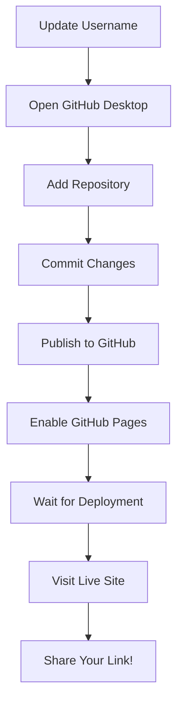

# 📚 Chronos - Documentation Index

## Quick Navigation

### 🚀 Getting Started
1. **[QUICK_DEPLOY.md](QUICK_DEPLOY.md)** - 5-minute deployment guide
2. **[GITHUB_DESKTOP_GUIDE.md](GITHUB_DESKTOP_GUIDE.md)** - Step-by-step with GitHub Desktop
3. **[PRE_PUSH_CHECKLIST.md](PRE_PUSH_CHECKLIST.md)** - Complete verification checklist

### 📖 Main Documentation
- **[README.md](README.md)** - Project overview, features, and usage
- **[DEMO_SCRIPT.md](DEMO_SCRIPT.md)** - Video demo recording script

### 🔧 Technical Guides
- **[GITHUB_DEPLOYMENT.md](GITHUB_DEPLOYMENT.md)** - Advanced deployment details
- **[DEPLOYMENT.md](DEPLOYMENT.md)** - Vultr backend deployment
- **[HACKATHON_COMPLIANCE.md](HACKATHON_COMPLIANCE.md)** - Requirements verification

### 📝 Development
- **[ENHANCEMENTS.md](ENHANCEMENTS.md)** - UI/UX improvements log
- **[QUICKSTART.md](QUICKSTART.md)** - Local development setup

---

## 🎯 What You Need to Do

### For GitHub Desktop Users (Recommended)

**Just 3 files to read:**
1. ✅ **QUICK_DEPLOY.md** - Start here (5 min read)
2. ✅ **GITHUB_DESKTOP_GUIDE.md** - Follow these steps
3. ✅ **PRE_PUSH_CHECKLIST.md** - Verify before pushing

**That's it!** Everything else is reference material.

---

## 📋 Deployment Workflow



---

## 🔍 Document Purposes

### QUICK_DEPLOY.md
**Purpose:** Fastest path to deployment  
**Read time:** 2 minutes  
**Use when:** You want to deploy NOW

### GITHUB_DESKTOP_GUIDE.md
**Purpose:** Complete GitHub Desktop walkthrough  
**Read time:** 10 minutes  
**Use when:** First time using GitHub Desktop

### PRE_PUSH_CHECKLIST.md
**Purpose:** Comprehensive verification  
**Read time:** 5 minutes  
**Use when:** Before pushing to GitHub

### README.md
**Purpose:** Project showcase and documentation  
**Read time:** 15 minutes  
**Use when:** Understanding the full project

### DEMO_SCRIPT.md
**Purpose:** Recording demo video  
**Read time:** 5 minutes  
**Use when:** Making presentation/video

### DEPLOYMENT.md
**Purpose:** Vultr backend deployment  
**Read time:** 20 minutes  
**Use when:** Setting up production backend

### GITHUB_DEPLOYMENT.md
**Purpose:** Technical deployment details  
**Read time:** 15 minutes  
**Use when:** Troubleshooting or advanced setup

---

## 🛠️ Tools & Scripts

### setup-github.sh
```bash
./setup-github.sh
# Automatically updates YOUR_USERNAME in all files
```

### Helper Commands
```bash
# Test build
npm run build

# Preview production
npm run preview

# Start development
npm run dev

# Check gitignore
cat .gitignore | grep .env
```

---

## 📱 Support Resources

### GitHub Desktop
- Download: https://desktop.github.com/
- Docs: https://docs.github.com/en/desktop

### GitHub Pages
- Docs: https://docs.github.com/en/pages
- Custom domains: https://docs.github.com/en/pages/configuring-a-custom-domain-for-your-github-pages-site

### Vite Deployment
- Guide: https://vitejs.dev/guide/static-deploy.html
- GitHub Pages: https://vitejs.dev/guide/static-deploy.html#github-pages

---

## 🎓 Learning Path

### Beginner
1. Read **QUICK_DEPLOY.md**
2. Follow **GITHUB_DESKTOP_GUIDE.md**
3. Use **PRE_PUSH_CHECKLIST.md**

### Intermediate
1. Understand **README.md** fully
2. Customize features
3. Read **ENHANCEMENTS.md** for ideas

### Advanced
1. Deploy backend with **DEPLOYMENT.md**
2. Set up custom domain
3. Add CI/CD enhancements

---

## ✅ Success Checklist

- [ ] Read QUICK_DEPLOY.md
- [ ] Ran `./setup-github.sh` with your username
- [ ] Followed GITHUB_DESKTOP_GUIDE.md
- [ ] Checked PRE_PUSH_CHECKLIST.md
- [ ] Published to GitHub (public)
- [ ] Enabled GitHub Pages (Actions)
- [ ] Deployment succeeded (green checkmark)
- [ ] Visited live site
- [ ] Security banner visible
- [ ] Updated README with your info
- [ ] Shared your link!

---

## 🌐 Your Final URLs

After deployment:

```
🎯 Live Demo
https://YOUR_USERNAME.github.io/chronos/

📦 Repository  
https://github.com/YOUR_USERNAME/chronos

🔒 Security Notice
https://YOUR_USERNAME.github.io/chronos/SECURITY_NOTICE.html

⚙️ Actions (Deployments)
https://github.com/YOUR_USERNAME/chronos/actions
```

---

## 💡 Pro Tips

### Before Recording Demo
- Read **DEMO_SCRIPT.md**
- Test all features locally
- Have example inputs ready
- Use Cyberpunk theme (more visual)

### For Portfolio
- Screenshot the app (both themes)
- Record short demo video
- Add to GitHub profile README
- Write blog post about building it

### Share on Social
- Tag: #AI #Hackathon #WebDev #React
- Mention: @RaindropAI @Vultr @GoogleAI
- Include live demo link
- Show screenshots/GIFs

---

## 🐛 Common Issues

### Site not loading?
→ Wait 2-3 minutes after first deploy  
→ Check Actions tab for errors  
→ Clear browser cache

### .env committed by mistake?
→ See PRE_PUSH_CHECKLIST.md fixes section  
→ Use `git rm --cached .env.local`

### Build failing?
→ Check Actions logs  
→ Test `npm run build` locally  
→ Verify all dependencies in package.json

### Changes not showing?
→ Commit and push in GitHub Desktop  
→ Wait for Actions to complete  
→ Hard refresh browser (Cmd+Shift+R)

---

## 🎉 You're Ready!

Everything is documented and ready for deployment.

**Next step:** Open **QUICK_DEPLOY.md** and start deploying!

---

## 📧 Questions?

If you get stuck:
1. Check the relevant guide above
2. Look for error in GitHub Actions logs
3. Verify checklist items
4. Review troubleshooting sections

---

<div align="center">

**Made with ❤️ for Raindrop x Vultr Hackathon**

[](QUICK_DEPLOY.md)

</div>
