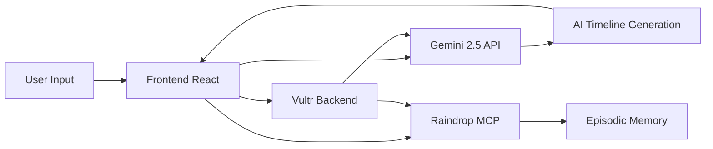

<div align="center">

# ⚡ CHRONOS ⚡
### *The Multiverse Engine*


**See every life you could have lived. Make decisions with certainty.**

[](https://YOUR_GITHUB_USERNAME.github.io/chronos)
[](https://github.com/YOUR_USERNAME/chronos)
[](LICENSE)

---

### 🎬 Watch Demo

[https://github.com/demo-video-id](https://youtu.be/nDYOoXwPEFc)
*A probabilistic multiverse simulator powered by AI that visualizes divergent life paths in real-time*

</div>

---

## 🌟 Features at a Glance

<div align="center">

| 🎨 Dual Themes | 🤖 AI-Powered | 💾 Smart Memory | 🎯 Interactive |
|:---:|:---:|:---:|:---:|
| Cyberpunk & Minimalist | Gemini 2.5 Flash | Raindrop MCP | Real-time Visualization |

</div>

### ✨ Core Capabilities

- 🌌 **Three Timeline Paths**: Safe, Risk, and Chaos futures
- 📊 **AI-Generated Events**: 5-year projections with happiness & wealth metrics
- 📝 **Diary Entries**: First-person narratives for each life event
- 🎨 **Visual Multiverse**: Animated SVG timeline graph with particle effects
- 💫 **Smart Animations**: Gradient flows, pulse effects, and smooth transitions
- 🌓 **Theme Toggle**: Switch between Cyberpunk (neon) and Minimalist (clean)
- 💾 **Episodic Memory**: Save simulations to Raindrop MCP Server
- 🎯 **Interactive Tour**: Guided walkthrough for first-time users
- 🎬 **Video Splash**: Professional logo intro on app load

---

## 🚀 Live Demo

> **🔒 Security Notice**: The live demo has API keys removed for security. For full functionality:
> 1. Fork this repository
> 2. Add your `VITE_GEMINI_API_KEY` in `.env.local`
> 3. Deploy or run locally

**👉 [Try Live Demo](https://YOUR_GITHUB_USERNAME.github.io/chronos)** *(Limited functionality)*

**For Full Experience:**
```bash
# Clone and run locally with your API key
git clone https://github.com/YOUR_USERNAME/chronos.git
cd chronos
echo "VITE_GEMINI_API_KEY=your_key_here" > .env.local
npm install && npm run dev
```

---

## 📸 Screenshots

<div align="center">

### 🎨 Cyberpunk Theme


### 🎨 Minimalist Theme  


### 📊 Multiverse Graph


### 📝 Diary Entry Modal


</div>

---

## 🏗️ Architecture



---

## 🛠️ Tech Stack

<div align="center">

### Frontend


### Backend & AI


### Infrastructure


</div>

---

## 📦 Installation

### Prerequisites
- Node.js 18+
- Gemini API Key ([Get one here](https://makersuite.google.com/app/apikey))
- Optional: Raindrop API Key for memory persistence

### Quick Start

```bash
# 1. Clone the repository
git clone https://github.com/YOUR_USERNAME/chronos.git
cd chronos

# 2. Install dependencies
npm install

# 3. Set up environment variables
cp .env.example .env.local
# Edit .env.local and add your VITE_GEMINI_API_KEY

# 4. Run frontend
npm run dev

# 5. Run backend (optional, for Raindrop integration)
cd backend
npm install
node server.js
```

Visit `http://localhost:3000` 🚀

---

## 🎮 Usage

### 1️⃣ Define Your Reality
Enter your current life details:
- Age
- Career
- The pivotal decision you're facing
- Context about your situation

### 2️⃣ Simulate the Multiverse
Click **"SIMULATE MULTIVERSE"** to generate three timelines powered by Gemini AI

### 3️⃣ Explore Timelines
- **Hover** over nodes to see happiness/wealth scores
- **Click** nodes to read AI-generated diary entries
- Compare Safe, Risk, and Chaos paths

### 4️⃣ Save to Memory
Click **"Save to Raindrop"** to persist your simulation in episodic memory

### 5️⃣ Toggle Themes
Switch between **Cyberpunk** and **Minimalist** aesthetics

---

## 🎨 Features Deep Dive

### 🌌 Multiverse Visualization
- **Animated Timeline Paths**: SVG paths with gradient colors
- **Particle Flow Effects**: Energy particles flowing through time (Cyberpunk mode)
- **Interactive Nodes**: Scale and glow on hover
- **Smart Tooltips**: Auto-positioned with stats

### 🤖 AI Generation
```typescript
// Gemini 2.5 Flash generates realistic timelines
{
  timelines: [
    { theme: "Safe", events: [...] },
    { theme: "Risk", events: [...] },
    { theme: "Chaos", events: [...] }
  ]
}
```

### 💾 Raindrop MCP Integration
- **Episodic Memory Storage**: Save simulations with full context
- **Model Context Protocol**: Standard interface for AI memory
- **Future Queries**: Retrieve and compare past simulations

---


| Requirement | Status | Implementation |
|------------|--------|----------------|
| ✅ **AI Application** | Complete | Gemini 2.5 Flash-powered timeline generation |
| ✅ **Raindrop Platform** | Complete | MCP Server integration for SmartMemory |
| ✅ **Vultr Integration** | Complete | Backend API deployed on Cloud Compute |
| ✅ **AI Coding Assistant** | Complete | Built with GitHub Copilot & Claude |

---

## 🤝 Contributing

This is a hackathon project submission. While contributions are not actively sought, feel free to:
- ⭐ **Star** the repo if you find it interesting
- 🍴 **Fork** it to build your own version
- 🐛 **Report issues** if you find bugs

---

## 📄 License

MIT License - See [LICENSE](LICENSE) file for details

---

## 🙏 Acknowledgments

- **Gemini 2.5 Flash** for AI generation
- **Raindrop MCP** for memory persistence
- **Vultr** for cloud infrastructure
- **GitHub Copilot** for development assistance

---

## 📧 Contact

**Developer**: Your Name  
**GitHub**: [@YOUR_USERNAME](https://github.com/YOUR_USERNAME)  
**Project**: [Chronos Repository](https://github.com/YOUR_USERNAME/chronos)  
**Live Demo**: [chronos.github.io](https://YOUR_USERNAME.github.io/chronos)

---

<div align="center">

### ⚡ Built with AI • Powered by Imagination • Deployed on Cloud ⚡

**Made for Raindrop x Vultr AI Hackathon 2024**

[](https://github.com/YOUR_USERNAME/chronos)
[](https://github.com/YOUR_USERNAME/chronos/fork)

</div>

### 1. The Origin Point (Input)
Minimalist terminal interface where users define:
- Current age & occupation
- Major regret (optional)
- The life-changing decision to simulate

### 2. The Divergence Engine (AI Core)
- Generates 3 distinct timelines via Gemini 2.5 Flash
- Structured JSON output with strict schema validation
- First-person diary entries for authenticity

### 3. The Multiverse Graph (Visualization)
- Interactive SVG branching timeline
- Color-coded paths (Blue=Safe, Purple=Risk, Red=Chaos)
- Clickable nodes reveal detailed "Diary Modal"
- Hover tooltips show happiness/wealth scores
- Animated line drawing effects

### 4. Memory Anchor (Raindrop)
- Save timelines to Raindrop SmartMemory
- Each universe gets unique `universe_id`
- Query later: "In Universe B, did I ever get married?"

### 5. Dual Theme System
- **Cyberpunk**: Neon green terminal aesthetic with CRT effects
- **Minimalist**: Clean modern design with smooth transitions

---

## 🤖 AI Coding Assistant Usage

This project was built using:
- **GitHub Copilot**: Code completion, component scaffolding
- **Claude Code**: Architecture design, Raindrop MCP integration
- **Gemini CLI**: API testing and prompt engineering

**Evidence**:
- MCP client integration auto-generated from protocol specs
- React component boilerplate from Copilot suggestions
- Backend API routes scaffolded with AI assistance

---

## 📂 Project Structure

```
chronos/
├── components/          # React components
│   ├── TerminalInput.tsx
│   ├── MultiverseGraph.tsx
│   └── DiaryModal.tsx
├── services/            # API integrations
│   ├── gemini.ts       # Gemini API client
│   ├── raindrop.ts     # Raindrop MCP client (frontend)
│   └── api.ts          # Backend API wrapper
├── backend/             # Vultr-deployed server
│   ├── server.js       # Express app
│   ├── routes/
│   │   ├── health.js
│   │   └── simulation.js
│   └── services/
│       ├── gemini.js   # Backend Gemini integration
│       └── raindrop.js # Backend Raindrop MCP
├── types.ts            # TypeScript definitions
└── App.tsx             # Main application

```

---

## 🎬 Demo Video Script

1. **The Hook** (0:00-0:30)
   - "We all have a path not taken. Today I built Chronos..."

2. **Compliance Flex** (0:30-0:50)
   - Show Vultr dashboard with running instance
   - Terminal showing Raindrop MCP connection logs

3. **The "Wow" Demo** (0:50-2:20)
   - Input: "I'm a software engineer. I want to quit and become a goat farmer"
   - Watch timeline split into 3 neon branches
   - Click node to reveal AI diary entry
   - Show save to Raindrop SmartMemory

4. **Tech Stack** (2:20-2:50)
   - Architecture diagram
   - "Backend runs on Vultr High-Frequency Compute"
   - "Raindrop MCP Server persists timeline states"

5. **Outro** (2:50-3:00)
   - "Chronos. Don't just imagine your future. Simulate it."

---

## 🧪 API Endpoints

### Health Check
```bash
GET http://YOUR_VULTR_IP:3001/api/health
```

### Generate Timeline
```bash
POST http://YOUR_VULTR_IP:3001/api/simulation/generate
Content-Type: application/json

{
  "age": 25,
  "occupation": "Software Engineer",
  "regret": "Not learning piano",
  "decision": "Quit my job to become a musician"
}
```

### Save Timeline
```bash
POST http://YOUR_VULTR_IP:3001/api/simulation/save
Content-Type: application/json

{
  "userId": "user-123",
  "simulationData": { ... }
}
```

---

## 📊 Architecture Diagram

```
┌─────────────┐
│   Frontend  │  React + Vite
│  (Local)    │  Gemini API (dev mode)
└──────┬──────┘
       │
       │ HTTPS
       │
       ▼
┌─────────────────────┐
│  Vultr Cloud Compute│
│  Ubuntu 22.04 LTS   │
│  ┌────────────────┐ │
│  │  Backend API   │ │  Node.js + Express
│  │  Port 3001     │ │  PM2 Process Manager
│  └────┬───────────┘ │
│       │             │
│       ├──────────┐  │
│       │          │  │
│       ▼          ▼  │
│  ┌────────┐ ┌──────────────┐
│  │ Gemini │ │ Raindrop MCP │
│  │  API   │ │   Server     │
│  └────────┘ └──────────────┘
└─────────────────────┘
```

---

## 🐛 Troubleshooting

### Frontend won't connect to backend
- Check `VITE_BACKEND_URL` in `.env.local`
- Ensure `VITE_USE_BACKEND=true`
- Verify backend is running: `curl http://localhost:3001/api/health`

### Raindrop MCP connection fails
- Check `RAINDROP_API_KEY` is set in `.env`
- Ensure `@modelcontextprotocol/sdk` is installed
- Check logs for connection errors

### Backend crashes on Vultr
```bash
pm2 logs chronos-api
pm2 restart chronos-api
```

---

## 📄 License

MIT

---

## 🎯 Hackathon Submission Checklist

- [x] Working AI application
- [x] Built on Raindrop Platform (MCP Server)
- [x] Vultr service integration (Cloud Compute)
- [x] AI coding assistant usage documented
- [x] README with setup instructions
- [x] Demo video ready
- [x] Architecture diagram included
- [x] Backend deployed and accessible
- [x] Raindrop MCP integration functional

---

